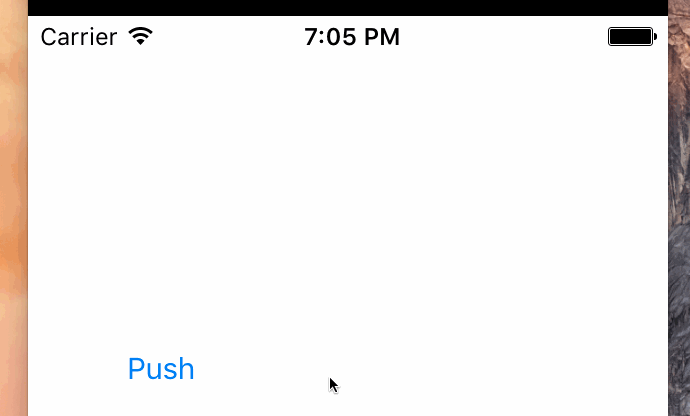

# PATabbarView

[](https://travis-ci.org/Inba/PATabbarView)
[](http://cocoapods.org/pods/PATabbarView)
[](http://cocoapods.org/pods/PATabbarView)
[](http://cocoapods.org/pods/PATabbarView)

  
**[Shrink Flags] header:YES mid:NO**

## Usage

To run the example project, clone the repo, and run `pod install` from the Example directory first.

## Requirements

## Installation

PATabbarView is available through [CocoaPods](http://cocoapods.org). To install
it, simply add the following line to your Podfile:

```ruby
pod "PATabbarView"
```

## Author

Inba, gyuuuuchan@gmail.com

## License

PATabbarView is available under the MIT license. See the LICENSE file for more info.
